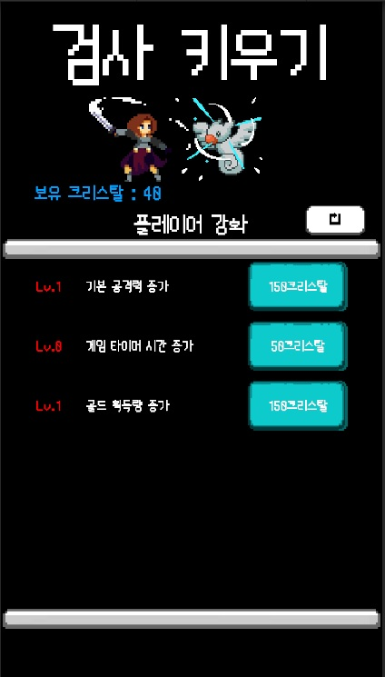
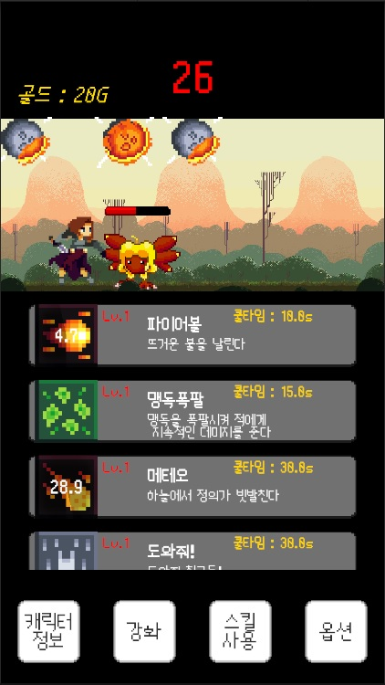
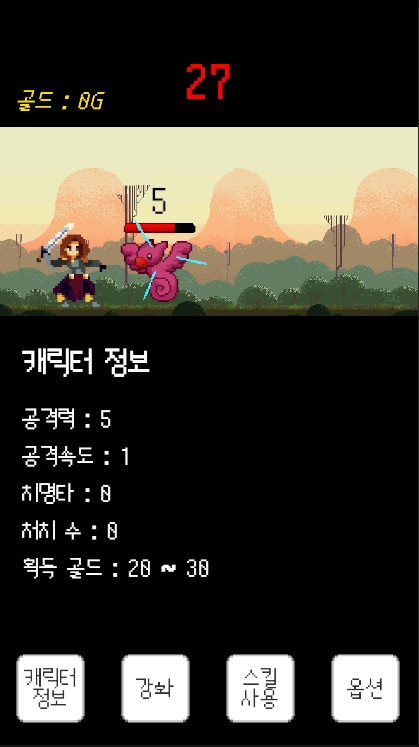

# 검사키우기(Raising Swordsman)
1인 제작 모바일 방치형 클리커

# 스크린샷

# 게임 개요

장르: 방치형 클리커

개발 인원: 1인

목표: 간단하고 쉬운 조작, 짧은 기간 내 출시 가능한 모바일 프로젝트

핵심 루프: 자동 전투 → 보상 수령 → 업그레이드 → 다음 몬스터/스테이지

기획 포인트: 업그레이드 동선 단순화, JSON 기반 데이터로 빠른 파라미터 조정

# 주요 기능

업그레이드 메뉴 자동 구성

enum으로 업그레이드 목록을 정의하고, 초기화 시 enum 개수에 맞춰 슬롯을 동적 생성합니다.

생성 후 스크롤뷰를 최상단으로 정렬하여 첫 노출 경험을 일정하게 유지합니다.

업그레이드 슬롯 초기화 로직

슬롯은 전달받은 enum 값을 기준으로 표시명/아이콘/비용/효과를 결정합니다.

플레이어 업그레이드 데이터는 JSON으로 저장/로드합니다.

몬스터 스폰/난수 이미지 선택

하이어라키에 소환 위치/프리팹을 지정하고, 난수값으로 몬스터 스프라이트/프리팹을 선택합니다.

스폰 시 배경 스크롤을 시작합니다.

플레이어 킬 카운트에 따라 체력을 스케일링합니다.

공격/스킬 트리거

애니메이션 이벤트 콜백으로 공격 함수를 호출해 타이밍 일치를 보장합니다.

1회 공격 애니메이션 중 2회 타격 처리 지원.

스킬 버튼 콜백에서 스킬 코드를 분기하여, 사전 지정 포지션(또는 후보 중 난수 일부)에서 스킬을 활성화합니다.

툴(공통 유틸) 스크립트

게임 일시정지/해제, 이미지 이동, 이미지/텍스트 Fade In/Out을 메서드로 제공.

# 기술 스택

Engine: Unity 2021.3.16f1 (LTS)

Language: C#

Libraries: Newtonsoft.Json (플레이어/스킬 데이터 직렬화), Unity UI

Patterns: Singleton(매니저), State

Input: IPointerDownHandler, IPointerUpHandler

Animation: Animation Event 기반 함수 호출
